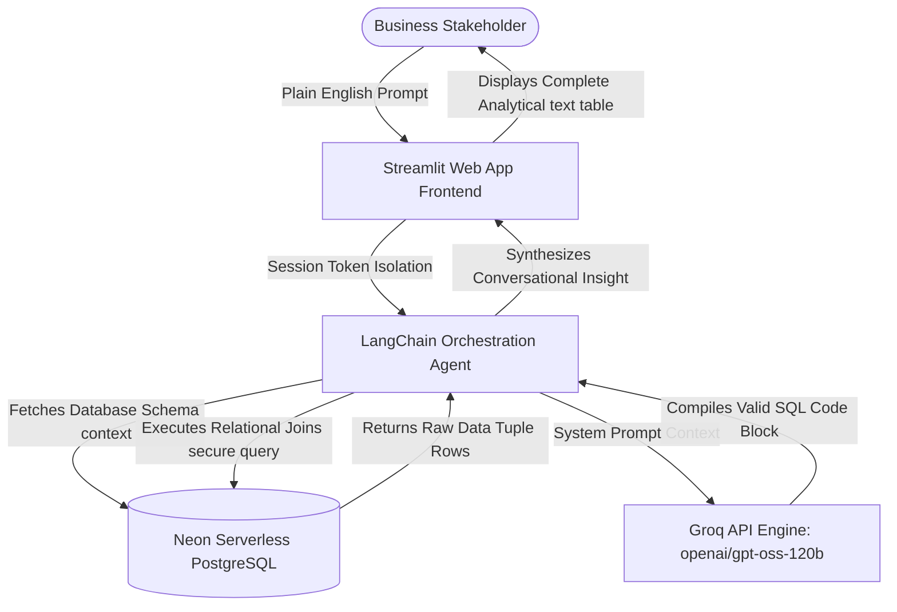

# Enterprise GenAI SQL Chat Copilot

A production-grade, secure Generative AI interface that bridges natural language business queries with structured cloud relational database systems. The application allows non-technical stakeholders to query complex transaction histories using plain English, which an intelligent orchestration layer translates into optimized SQL executable parameters live.

## 🚀 Live Production Deployment
* **Live Web App URL:** https://streamlit.app
* **Database Infrastructure Host:** Neon Serverless PostgreSQL (https://neon.tech)
* **Inference Processing Network:** Groq Cloud Console (https://groq.com)

---

## 🏗️ System Architecture & Data Topology



---

## 🛠️ The Enterprise Production Stack
* **Frontend Presentation:** Streamlit (Stateful visual timeline UI wrapper)
* **AI Orchestration Framework:** LangChain (Autonomous Tool-calling routing agents)
* **Large Language Model (LLM Brain):** Groq API Cloud — `openai/gpt-oss-120b` (Zero temperature, hyper-deterministic reasoning)
* **Storage Tier Infrastructure:** Neon Tech (Serverless PostgreSQL cluster)
* **Connection Layer Driver:** Psycopg2-binary & SQLAlchemy Core URL mapping

---

## 🧬 Core Technical Capabilities & Value Proven

### 1. Unified Cloud Orchestration Loop
The system utilizes a model-agnostic schema parsing mechanism. The moment a prompt is logged, the `create_sql_agent` interface extracts the metadata definitions of the `customers`, `products`, and `orders` tables, formatting them dynamically to ensure the generated query strictly avoids missing properties or invalid schema joins.

### 2. Streamlit Cloud Secrets Masking (`st.secrets`)
To adhere to high-grade infrastructure guidelines, all database credentials and third-party API processing authentication keys are completely isolated from the repository codebase using strict TOML variables configuration masking, protecting the operational perimeter from automated credential harvesting scripts.

### 3. Data Hygiene & Validation Mapping
This project acts as an advanced extension tier to our **Project 1 Data Pipeline**, parsing multi-table data logs into real-time metrics, dynamically managing custom constraints, currency string rendering, and historical tracking without creating table structure replicas or database clutter.

---

## 💻 Local Workspace Initialization & Setup Guide

### 1. Initialize System Isolation Boundaries
```bash
# Enter directory and spawn local virtual python instance
cd genai-sql-copilot
python -m venv env
source env/bin/activate  # On Windows PowerShell use: .\env\Scripts\activate
```

### 2. Configure Local Configuration Enclave
Create a `.env` text boundary parameters file directly within the folder root path containing the parameters configuration template below:
```env
DB_HOST=localhost
DB_NAME=fde_retail_db
DB_USER=postgres
DB_PASSWORD=your_secure_password
DB_PORT=5432
GROQ_API_KEY="your_private_alphanumeric_gsk_token"
DATABASE_URL="postgresql://neondb_owner:your_neon_cloud_connection_string"
```

### 3. Populate Dependencies Inventory & Fire Up Application
```bash
# Download internal requirements matrix list
pip install -r requirements.txt

# Launch local browser instance layout environment
streamlit run app.py
```

---

## 📊 Analytical Verification Queries Performed
The underlying agent is trained to structurally execute and clear multi-table relational aggregations, such as compiling core gross revenue:

```sql
SELECT SUM(total_amount) AS gross_revenue FROM orders;
```

### System Log Response Output Verified:
* **User Input:** *"What is our gross revenue?"*
* **AI Agent Output Engine Thought Process:** `SELECT SUM(total_amount) FROM orders;`
* **Live System Display Response Return:** *"The total gross revenue generated from all successful orders is **\$570.00**."*
* LIVE LINK: [https://genai-sql-copilot-ri3pwgvnuvspk3ebkntwbk.streamlit.app/](https://genai-sql-copilot-29in3xnnp9qqmj4ukjvuie.streamlit.app/)
